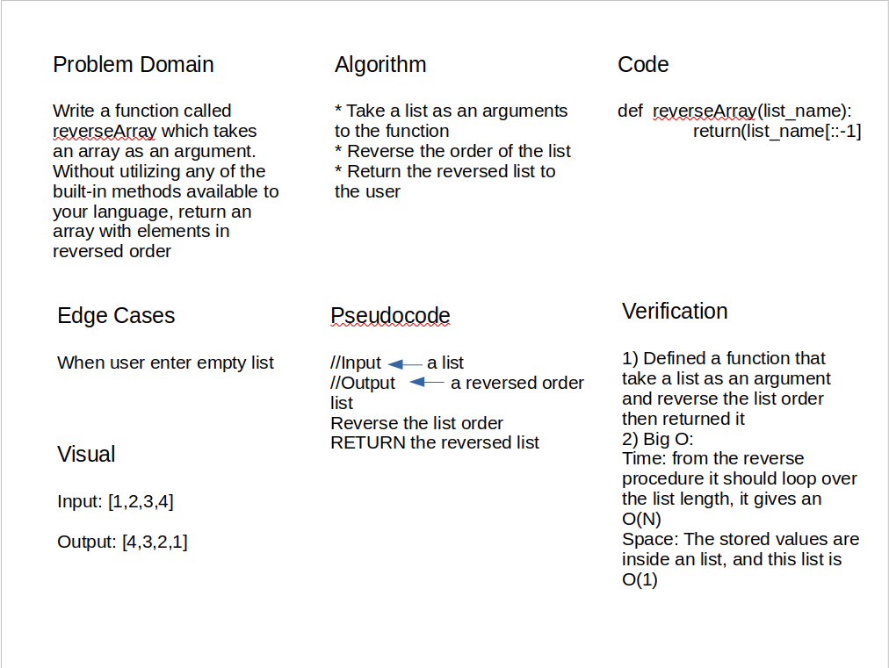

# Reverse an Array

Write a function called reverseArray which takes an array as an argument. Without utilizing any of the built-in methods available to your language, return an array with elements in reversed order

## Whiteboard Process

## Approach & Efficiency

I create a simple function that takes an array as an input, reverse it's order then return the reversed array

Big O:

* Time => from the reverse procedure it should loop over the list length, it gives an O(N)

* Space => The stored values are inside an list, and this list is O(1) because the list's length is fixed, and does not depend on any looping
