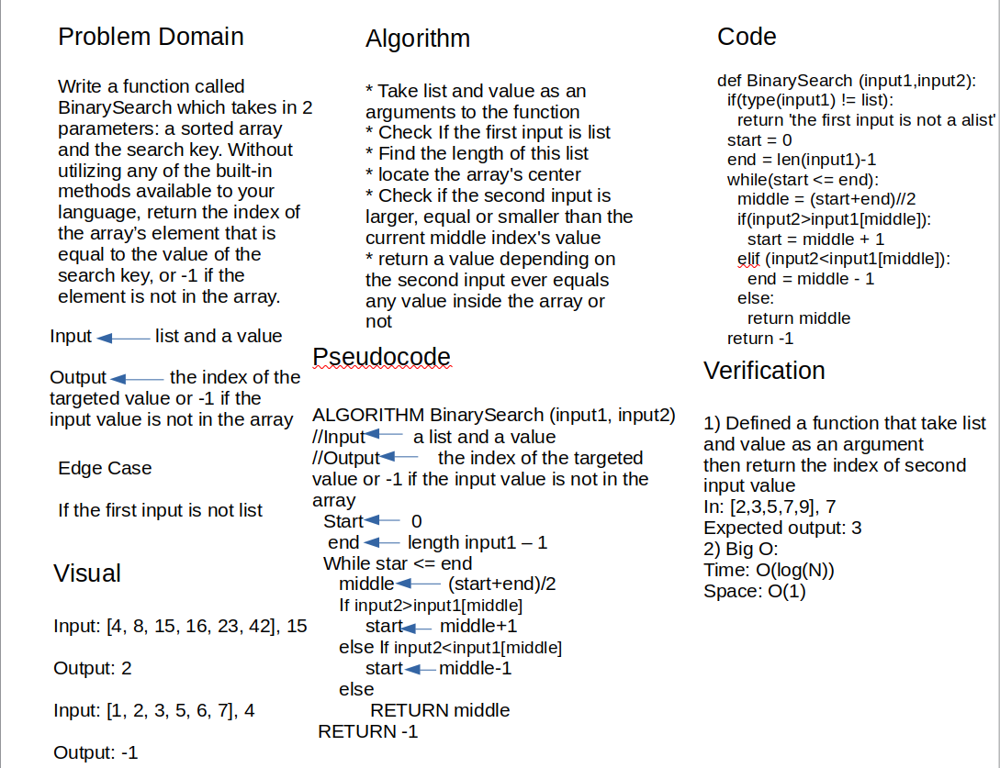

# Insert Shift Array

Write a function called BinarySearch which takes in 2 parameters: a sorted array and the search key. Without utilizing any of the built-in methods available to your language, return the index of the array’s element that is equal to the value of the search key, or -1 if the element is not in the array.

## Whiteboard Process

## Approach & Efficiency

create a BinarySearch function that takes two arguments first one is list and secound one is a value. The target output to find the indes of the seconed parameter using binary search. so, I first check if the first parameter is list and return a massege if not. After that find the length of this list and locate the list's center then check if the second input is larger, equal or smaller than the current middle index's value  finally, return a value depending on the second input ever equals any value inside the lsit or -1 it the second input value is not in the list.

Big O:

- Time => from the while loop, we are looping using a logarithmic method, it gives an O(log n)

- Space => the stored values are inside a variables only so it is O(1)
