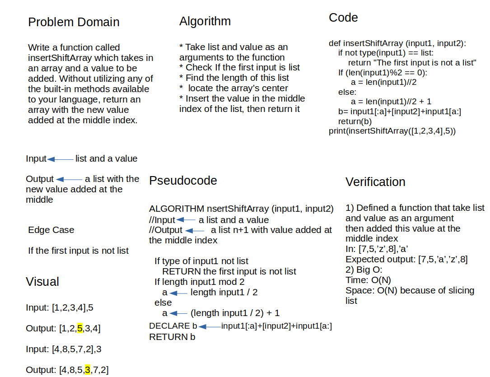

# Insert Shift Array

Write a function called insertShiftArray which takes an array and a variable as inputs. Without utilizing any of the built-in methods available to your language, return an array with the element inserted at the array's center

## Whiteboard Process

## Approach & Efficiency

create a insertShiftArray function that takes two arguments first one is list and secound one is a value. The target output to add the seconed parameter at the middle of this list. so, I first check if the first parameter is list and return a massege if not. After that check lenght of the list if it even or odd and locate the middle index of the list then add the seconed parmater to this index then returb the list.

Big O:

- Time => It gives an O(N)

- Space => the stored values are inside an array, using slicing method which is O(n)
