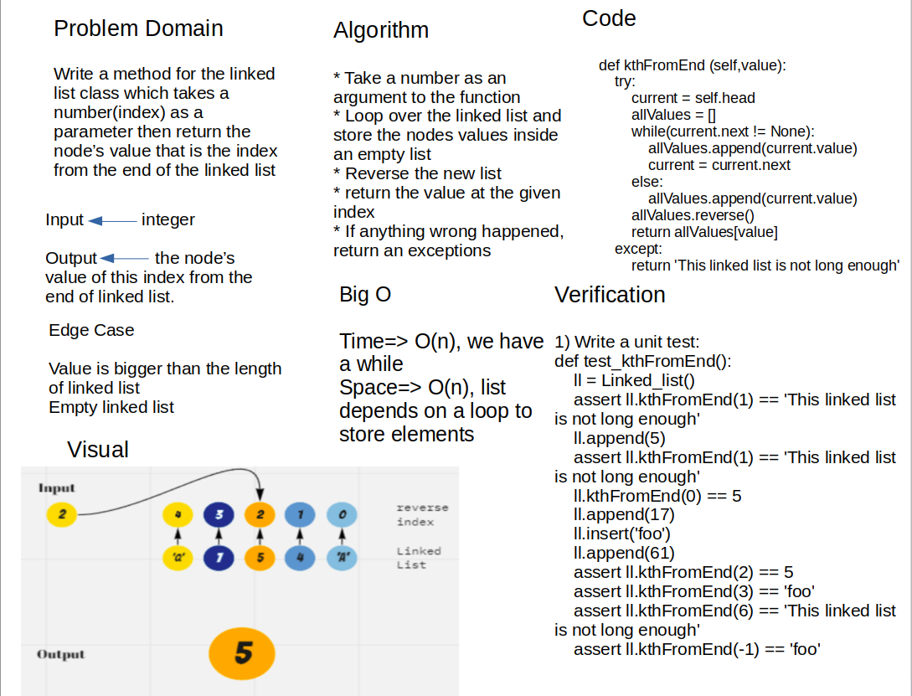

# Singly Linked List

[code Link](linked_list/linked_list.py)

Linked List can be defined as a data structure that containes of nodes that connected or points to each other.

A node contains two fields i.e. data stored at that particular address and the pointer which contains the address of the next node in the memory.

## Challenge

Within the LinkedList class, include method to axcess the property of head value to check if the value in linked list or not. And, Upon instantiation, an empty Linked List should be created.

## Whiteboard Process



## Approach & Efficiency

First create a class for creating a node to store a value, and a pointer to the next node. Then create a  class for creating instances of a Linked List inside this class define three methode. first one is insert to create a Node with the value that was passed and adds it to the head of the linked list shifting all other values down, second one is include to return True or False if value is in the linked list or not and third one str method that returns a string representing all the values in the Linked List. ALso, append method Adds a node of a value to the end of Linked List, insertAfter to add a node of a new_value after node has value==value in Linked List and insertBefore to add a node of a new_value after node has value==value in Linked List

## API

`insert`: to create a Node with the value that was passed and adds it to the head of the linked list shifting all other values down.

- time : O(1)
- space : O(1)

`includes`: to check if the value in the linked lis or not then returns True or False if value is in the linked list or not.

- time : O(n)
- space : O(1)

`__str__`: to return a string representing all the values in the Linked List.

- time : O(n)
- space : O(n)

`append`: to add a value to the end of the linked list

- time : O(n)
- space : O(n)

`insertBefore`: to add a node of a new_value before node has value==value in Linked List

- time : O(n)
- space : O(1)

`insertAfter`: to add a node of a new_value after node has value==value in Linked List

- time : O(n)
- space : O(1)

`kthFromEnd`: to retrn the node's value of the index of input value from the end of the linked list.

- time : O(n)
- space : O(n)

## Solution

create an object:

```python
obj= Linked_list()  #create an object
obj.insert(5)       #to insert node with value in the linked list
obj.insert(4)       #to insert node with value in the linked list
str(obj)            #string representation of the linkend list nodes with their values so the output
                    #of this: {5} -> {4} -> None
obj.append(8)       #to add a node of value of 8 to the end of the linked list
str(obj)            #the output will be {5} -> {4} -> {8} -> None
obj.insertAfter(5, 2)  #to add a node of value of 2 after node has value of 5 in Linked List
obj.insertBefore(8,3)  #to add a node of value of 3 before node has value of 8 in Linked List

str(obj)            #the output will be {5} -> {2} -> {4} -> {1} -> {8} -> None
```
