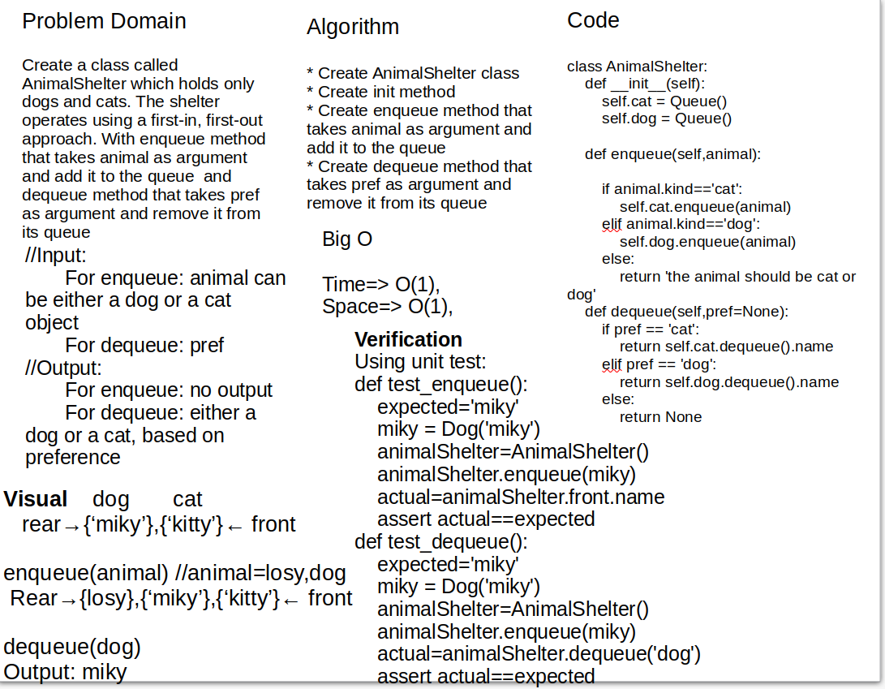

# Challenge Summary

## Code link

[Code Link](stack_queue_animal_shelter/stack_queue_animal_shelter.py)

Create a class called AnimalShelter which holds only dogs and cats. The shelter operates using a first-in, first-out approach.

- Implement the following methods:
    1. enqueue(animal): adds animal to the shelter. animal can be either a dog or a cat object.
    2. dequeue(pref): returns either a dog or a cat. If pref is not "dog" or "cat" then return null.

## Whiteboard Process



## Approach & Efficiency

### enqueue

enqueue(animal): adds animal to the shelter. animal can be either a dog or a cat object.

Big O :

- time : O(1)
- space : O(1)

### dequeue

dequeue(pref): returns either a dog or a cat. If pref is not "dog" or "cat" then return null.

Big O :

- time : O(n)
- space : O(1)

## Solution

First I create AnimalShelter that contains three methods init for atributes. and enqueue that takes animal object as an argument.

```python
def enqueue(self,animal):
        """
        enqueue: method that takes animal as argument and add it to the queue 
        """
        if not self.rear:
                self.rear = animal
                self.front = animal
        else:
            self.rear.next = animal
            self.rear = animal
```

Then i used a code for the dequeue method, first i checked if the Queue is empty or not, then checked if the prep is 'dog' or 'cat' or something else, then i dequeue the value if exists

```python
def dequeue(self,pref=None):
        """
        dequeue: method that takes pref as argument and remove it from its queue 
        """
        if not self.rear:
            return None
        if (pref != 'dog' and pref != 'cat'):
            return None
        else:
            temp = self.front
            if self.front.kind == pref:
                self.front = self.front.next
                temp.next = None
                if not self.front:
                    self.rear = None
                return temp.name
            else:
                while temp.next:
                    if temp.next.kind == pref:
                        to_return = temp.next.name
                        temp.next =  temp.next.next
                        return to_return
                    else:
                        temp = temp.next
                return None
```
