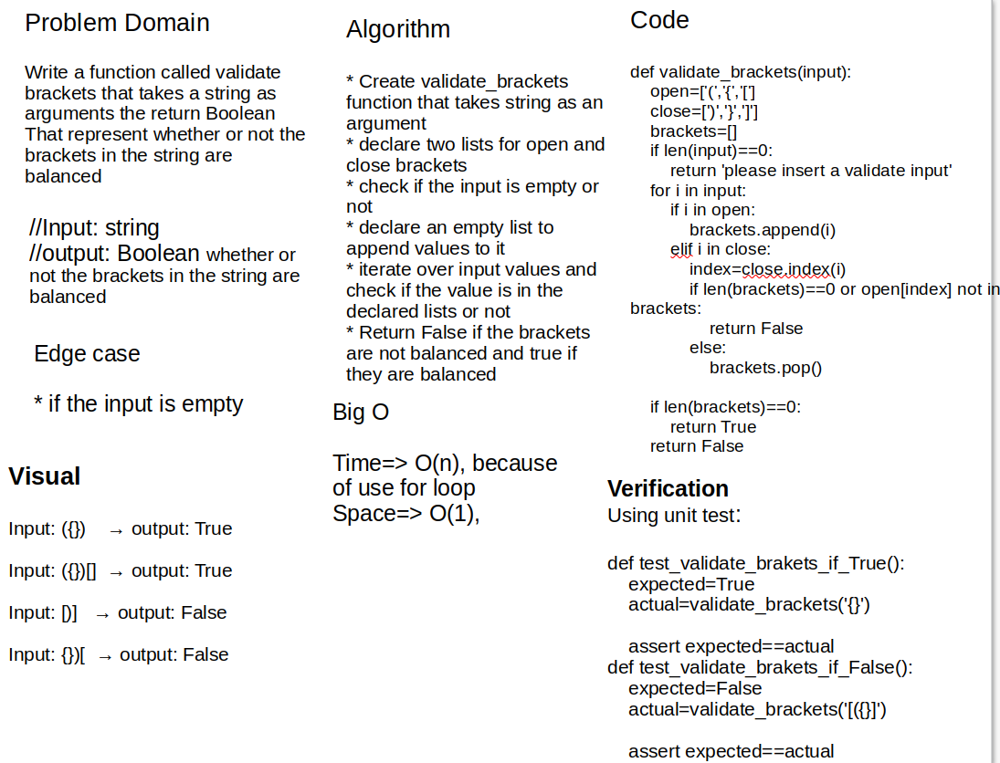

# Challenge Summary

Write a function called validate brackets that takes a string as arguments the return Boolean
That represent whether or not the brackets in the string are balanced

[Code link](stack_queue_brackets/stack_queue_brackets.py)

## Whiteboard Process



## Approach & Efficiency

Create validate_brackets function that takes string as an argument then declare two lists for open and close brackets and declare an empty list to append values to it. check if the input is empty or not then iterate over input values and check if the value is in the declared lists or not finally return False if the brackets are not balanced and true if they are balanced.

Big O:

- time: O(n), becouse used for loop to iterate over the input
- space: O(1)

## Solution

```python
def validate_brackets(input):
    open=['(','{','[']
    close=[')','}',']']
    brackets=[]
    if len(input)==0:
        return 'please insert a validate input'
    for i in input:
        if i in open:
            brackets.append(i)
        elif i in close:
            index=close.index(i)
            if len(brackets)==0 or open[index] not in brackets:
                return False
            else:
                brackets.pop()
    
    if len(brackets)==0:
        return True
    return False

if __name__=='__main__':
    
    print(validate_brackets('[({})]'))
```
