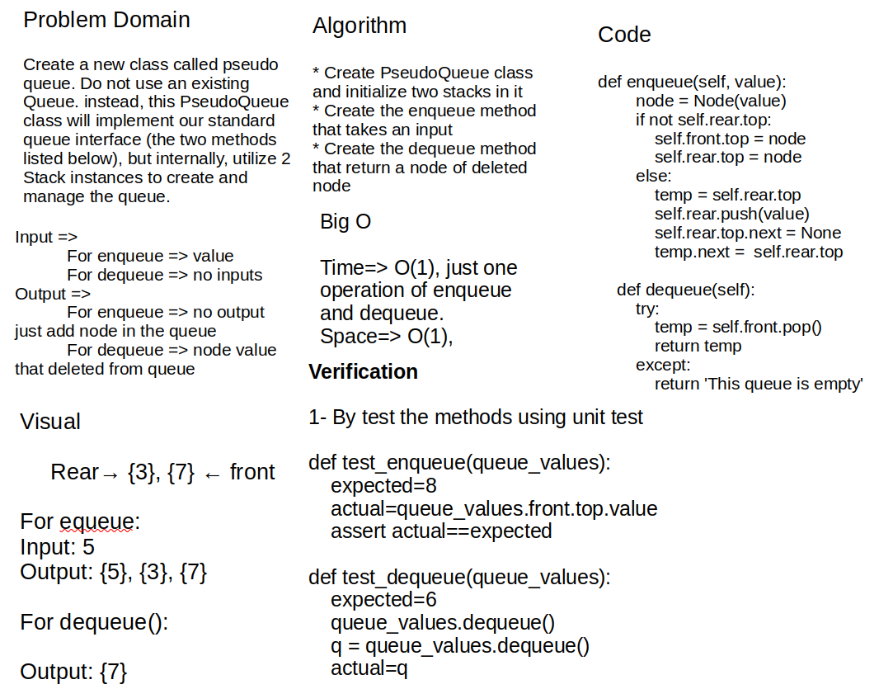

# stack-queue-pseudo

## code link

[code Link](stack_queue_pseudo/stack_queue_pseudo.py)

## Challenge Summary

Create a brand new PseudoQueue class. Do not use an existing Queue. Instead, this PseudoQueue class will implement our standard queue interface (the two methods listed below), but will internally only utilize 2 Stack objects. Ensure that you create your class with the following methods:

- enqueue(value) which inserts value into the PseudoQueue, using a first-in, first-out approach.

- dequeue() which extracts a value from the PseudoQueue, using a first-in, first-out approach.

## Whiteboard Process



## Approach & Efficiency

I started with creating a class called PseudoQueue, that takes two stacks as an input, to create a proper front and rear to the Queue. then I use push method from stack class in enqueue to add node in queue and I use pop method from stack class in dequeue to delete node from front of queue which its the top node of stack

## Solution

solution with utilizing the push and pop methods, which is one below

```python

def enqueue
    node = Node(value)
    if not self.rear.top:
        self.front.top = node
        self.rear.top = node
    else:
        temp = self.rear.top
        self.rear.push(value)
        self.rear.top.next = None
        temp.next =  self.rear.top

def dequeu
    temp = self.front.pop()
    return temp
```

this solution is based on using the pop and push methods from stack class
