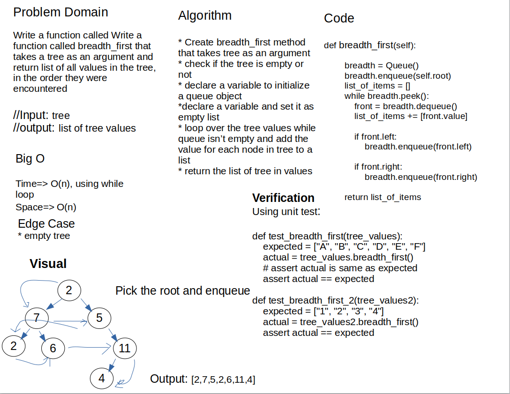

# Breadth first

## Challenge Summary

Find the values in a Binary Tree using breadrh first traverse, create a function that takes tree as an argument, then returns list of all values in the tree, in the order they were encountered.

## Whiteboard Process



## Approach & Efficiency

The approach used in this challenge is looping over all the elements inside the binary tree, because it's not sorted as the binary search tree, saving the each value in a list. then return the list of all values in tree

- `breadth_first`: to return list of all values in the tree, in the order they were encountered
  - Big O:
    - time O(n): the solution used while to loop over all values in tree
    - spac O(n): store all values in the tree using list

## Solution

for the solution, this code loops over all the nodes using the while loop, saving the each value in a list. then return the list of all values in tree, then return these values

```python
    def breadth_first(tree):
        """
        A binary tree method which returns a list of items that it contains

        input: None

        output: tree items
        """
        breadth = Queue()
        breadth.enqueue(tree.root)

        list_of_items = []

        while breadth.peek():
            front = breadth.dequeue()
            list_of_items += [front.value]

            if front.left:
                breadth.enqueue(front.left)

            if front.right:
                breadth.enqueue(front.right)

        return list_of_items
```
