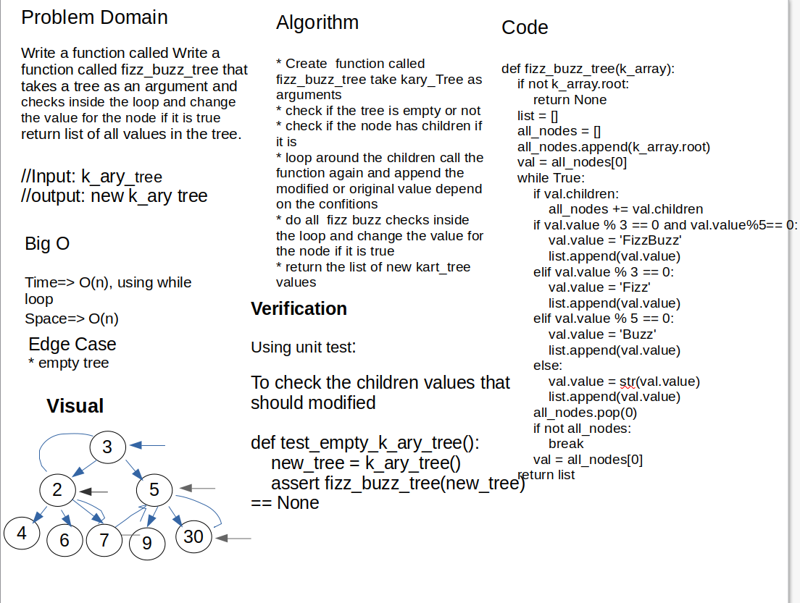

# Challenge Summary

Write a function called fizz buzz tree

- Arguments: k-ary tree
- Return: new k-ary tree

Determine whether or not the value of each node is divisible by 3, 5 or both. Create a new tree with the same structure as the original, but the values modified as follows:

- If the value is divisible by 3, replace the value with “Fizz”
- If the value is divisible by 5, replace the value with “Buzz”
- If the value is divisible by 3 and 5, replace the value with “FizzBuzz”
- If the value is not divisible by 3 or 5, simply turn the number into a String.

## Whiteboard Process



## Approach & Efficiency

1. Ceate  function called fizz_buzz_tree take kary_Tree as arg
2. create inside it another function caled traverse take node ass arg
3. check if the node has children if it is
4. loop around the children call the function again and put the children as arg
5. do all  fizz buzz checks inside the loop and change the value for the node it it is true
6. trutn the kary_Tree

### Big O

- Time: O(n) using while loop to loop over all nodes
- space: O(n) using list to append the values of nodes

## Solution

```python
def fizz_buzz_tree(k_array):
    if not k_array.root:
        return None
    list = []
    all_nodes = []
    all_nodes.append(k_array.root)
    val = all_nodes[0]
    while True:
        if val.children:
            all_nodes += val.children
        if val.value % 3 == 0 and val.value % 5 == 0:
            val.value = 'FizzBuzz'
            list.append(val.value)
        elif val.value % 3 == 0:
            val.value = 'Fizz'
            list.append(val.value)
        elif val.value % 5 == 0:
            val.value = 'Buzz'
            list.append(val.value)
        else:
            val.value = str(val.value)
            list.append(val.value)
        all_nodes.pop(0)
        if not all_nodes:
            break
        val = all_nodes[0]
    return list

```
