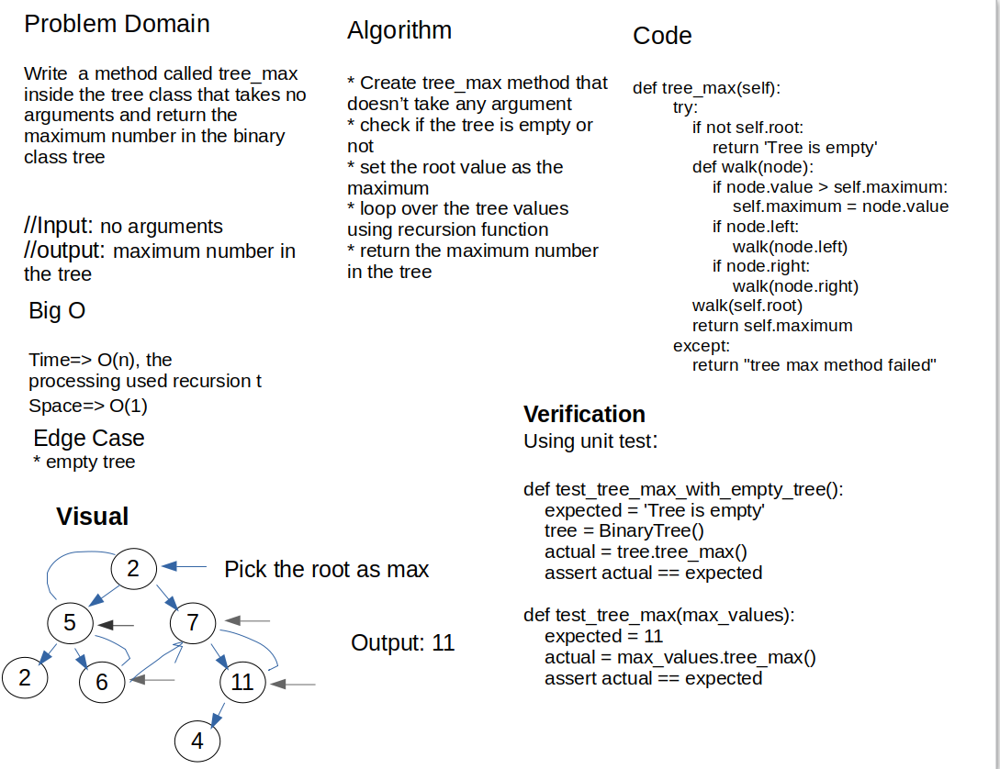

# Maximum value in tree

## Code link

[Code](trees/trees.py)

## Challenge Summary

Find the Maximum Value in a Binary Tree, create a method that takes no inputs, and returns the maximum value inside the Binary Tree

## Whiteboard Process



## Approach & Efficiency

The approach used in this challenge is looping over all the elements inside the binary tree, because it's not sorted as the binary search tree, saving the maximum value then return it. all the edge cases are covered properly, that will be discussed inside the Solution

- `tree_max`: to find the maximum value in the tree
  - Big O:
    - time O(n): the solution used recursion to loop over all values in tree
    - spac O(1): just store the data in a variable

## Solution

for the solution, this code loops over all the nodes using the regression logic, checks every value inside the Tree if it's bigger or smaller than the temporary one, then return the largest one, in case of an empty tree, the return is None, the following is the code

```python
   def tree_max(self):
        """
        A method to find the maximum value in the tree
        
        arguments: None
        output: number maximum value in the tree
        """
        try:
            if not self.root:
                return 'Tree is empty'
            def walk(node):
                if node.value > self.maximum:
                    self.maximum = node.value
                if node.left:
                    walk(node.left)
                if node.right:
                    walk(node.right)
            walk(self.root)
            return self.maximum 
        except:
            return "tree max method failed"
```
